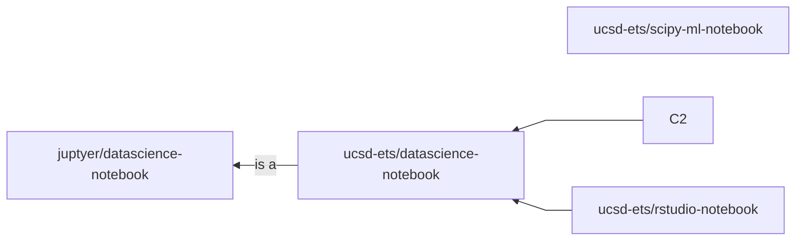

# DataHub Docker Stack: Home Page

## Overview

This Github repository builds and maintains the [standard suite of Docker containers](https://support.ucsd.edu/services?id=kb_article_view&sysparm_article=KB0032173&sys_kb_id=e61b198e1b74781048e9cae5604bcbe0) supported by UC San Diego Educational Technology Services.

Currently, we support 4 images:

- datahub-base-notebook (the base notebook from which all others inherit)
- datascience-notebook (dpkt + nose + datascience libs)
- scipy-ml-notebook (has PyTorch/Tensorflow + GPU Support)
- rstudio-notebook (installs the RStudio IDE)

## Documentation

To learn more about how each component works, please navigate to its own documentation. We suggest reading [Architecture](/Documentation/architecture.md) first.

- Table of Contents
  - [Actions](/Documentation/actions.md): how Github Actions help automate our key tasks.
  - [Architecture](/Documentation/architecture.md): the file architecture of this repository and how each component relates to each other.
  - [Images](/Documentation/images.md): what we use and how we use them to maintain our Docker images.
  - [Scripts](/Documentation/scripts.md): how the backend scripts work and what each module does in the bigger picture.
  - [Tests](/Documentation/tests.md): how we perform tests and the difference among them.
  - [Development Guide](/Documentation/dev_guide.md): useful tips to look at and follow if you want to contribute to this repository.
